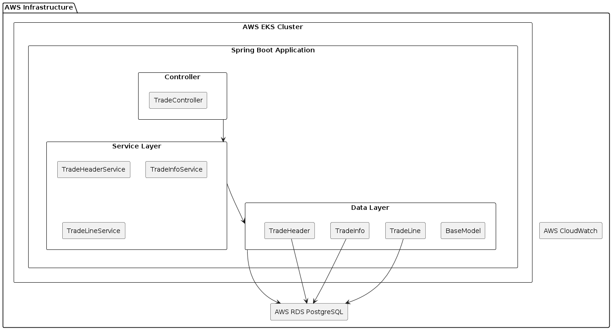

# AWS EKS RDS CloudWatch Dashboard with Java Spring Boot and Ansible

## Overview
This project demonstrates deploying Java Spring Boot microservices to AWS EKS clusters with RDS PostgreSQL databases and monitoring using AWS CloudWatch. The deployment process is automated using Ansible and Maven.

This project involves setting up and deploying a Java Spring Boot microservices application in an AWS EKS cluster, utilizing AWS RDS for database management and AWS CloudWatch for monitoring. The project is structured to handle multiple environments: develop, qa, demo, and production.

Application Architecture


```plantuml
@startuml
!define RECTANGLE class

package "AWS Infrastructure" {
    RECTANGLE "AWS EKS Cluster" as EKS {
        RECTANGLE "Spring Boot Application" as SpringBootApp {
            RECTANGLE "Controller" as Controller {
                RECTANGLE "TradeController" as TradeController
            }
            RECTANGLE "Service Layer" as ServiceLayer {
                RECTANGLE "TradeHeaderService" as TradeHeaderService
                RECTANGLE "TradeInfoService" as TradeInfoService
                RECTANGLE "TradeLineService" as TradeLineService
            }
            RECTANGLE "Data Layer" as DataLayer {
                RECTANGLE "TradeHeader" as TradeHeader
                RECTANGLE "TradeInfo" as TradeInfo
                RECTANGLE "TradeLine" as TradeLine
                RECTANGLE "BaseModel" as BaseModel
            }
        }
    }

    RECTANGLE "AWS RDS PostgreSQL" as RDS {
        TradeHeader --> RDS
        TradeInfo --> RDS
        TradeLine --> RDS
    }

    RECTANGLE "AWS CloudWatch" as CloudWatch {
        SpringBootApp -[hidden]--> CloudWatch : Monitoring
    }
}

Controller --> ServiceLayer
ServiceLayer --> DataLayer
DataLayer --> RDS

@enduml

```

## Project Structure

```plaintext
your-repo/
├── .github/
│   └── workflows/
│       └── build.yml
├── ansible/
│   ├── inventories/
│   │   ├── develop/
│   │   │   └── hosts.yml
│   │   │   └── group_vars/
│   │   │       └── all.yml
│   │   ├── qa/
│   │   │   └── hosts.yml
│   │   │   └── group_vars/
│   │   │       └── all.yml
│   │   ├── demo/
│   │   │   └── hosts.yml
│   │   │   └── group_vars/
│   │   │       └── all.yml
│   │   └── production/
│   │       └── hosts.yml
│   │       └── group_vars/
│   │           └── all.yml
│   ├── playbooks/
│   │   ├── create_eks_cluster.yml
│   │   ├── create_rds.yml
│   │   ├── github_actions_build.yml
│   │   ├── deploy_springboot.yml
│   │   ├── cloudwatch_eks.yml
│   │   ├── cloudwatch_springboot.yml
│   │   └── cloudwatch_rds.yml
│   └── roles/
│       └── common/
│           └── tasks/
│               └── main.yml
├── terraform/
│   ├── develop/
│   │   └── main.tf
│   ├── qa/
│   │   └── main.tf
│   ├── demo/
│   │   └── main.tf
│   └── production/
│       └── main.tf
├── src/
│   ├── main/
│   │   ├── java/
│   │   │   └── com/
│   │   │       └── tmh/
│   │   │           └── aws/
│   │   │               └── controller/
│   │   │                   └── TradeController.java
│   │   └── resources/
│   │       ├── application.yaml
│   │       ├── application-develop.yml
│   │       ├── application-qa.yml
│   │       ├── application-demo.yml
│   │       └── application-production.yml
├── pom.xml
└── README.md
```

## Prerequisites
- JDK 21 
- Maven 
- AWS CLI configured with appropriate permissions. AWS CLI: Ensure that the AWS CLI is installed and configured on your local machine. Installation instructions can be found here https://docs.aws.amazon.com/cli/latest/userguide/getting-started-install.html.
- Terraform 
- Ansible

## Setting Up Local AWS Profiles
To configure AWS CLI profiles for each environment, run the following commands and follow the prompts to enter your AWS Access Key ID, Secret Access Key, region, and output format for each profile.

## AWS Local Profiles Dependency
- To manage AWS configurations securely and avoid hardcoding sensitive information in the source code, this project relies on AWS local profiles.
- AWS CLI profiles allow you to configure and manage your AWS credentials and settings for different environments (develop, qa, demo, production) locally on your development machine or CI/CD pipeline.

### Creating AWS Profiles For Each Environment (develop, qa, demo, production)
```shell
aws configure --profile develop
aws configure --profile qa
aws configure --profile demo
aws configure --profile production
```
By setting up these local AWS profiles, you ensure that the project can securely access AWS resources without hardcoding sensitive information in the codebase. These profiles will be referenced in the Maven build configurations and Ansible playbooks to manage and deploy the infrastructure and application.

### Using AWS Profiles in Maven Commands
When running Maven commands, specify the appropriate AWS profile for the environment: develop, qa, demo, or production.
```shell
mvn clean install -P<profile-name> -Denv=<env> -Daws.profile=<aws-profile>
```
Replace <profile-name> with the appropriate Maven profile (e.g., setup-rds, create-eks, deploy-app), <env> with the environment (e.g., develop, qa, demo, production), and <aws-profile> with the corresponding AWS CLI profile.

#### Example Commands
Set up RDS for Environments develop, qa, demo, production
```shell
mvn clean install -Psetup-rds -Denv=develop -Daws.profile=develop
mvn clean install -Pcreate-eks -Denv=qa -Daws.profile=qa
mvn clean install -Pdeploy-app -Denv=demo -Daws.profile=demo
mvn clean install -Pdeploy-app -Denv=production -Daws.profile=production
````

## Setup

### 1. Clone the Repository
```bash
git clone <this repo URL>
cd aws-eks-rds-cloudwatch-dashboard-java-spring-ansible
```

### 2. Configure AWS and Ansible
Ensure your AWS CLI is configured with appropriate permissions and set up the Ansible inventory files with the correct AWS region, EKS cluster names, RDS details, and other necessary variables.

### 3. Build the Project
Build the project using Maven. The develop profile is active by default and does not run Ansible as part of the build process.

```bash
mvn clean package -Pdevelop
```

### 4. Deploy to Different Environments
To deploy to QA, demo, or production environments, use the respective Maven profiles. These profiles will run the Ansible playbooks to deploy the Spring Boot application to AWS EKS and configure the RDS and CloudWatch dashboards.

##### Deploy to QA or Demo or Production
```bash
mvn clean package -Pqa
mvn clean package -Pdemo
mvn clean package -Pproduction
```

## Application Endpoints
### Trade Management
The TradeController class provides an endpoint for managing trades. The /createTrade endpoint creates a new trade and returns the trade information.

##### Create a New Trade
```bash
curl http://localhost:8080/api/v1/trade-management/createTrade
```

## Ansible Playbooks
### create_eks_cluster.yml
Creates an EKS cluster in the specified AWS region.

```shell
mvn clean install -Pcreate-eks-develop
mvn clean install -Pcreate-eks-qa
mvn clean install -Pcreate-eks-demo
mvn clean install -Pcreate-eks-production
```


### create_rds.yml
Creates an RDS PostgreSQL database.
```shell
mvn clean install -Psetup-rds-develop
mvn clean install -Psetup-rds-qa
mvn clean install -Psetup-rds-demo
mvn clean install -Psetup-rds-production
```

### github_actions_build.yml
Triggers GitHub Actions workflow to build the Java Spring Boot code.

### deploy_springboot.yml
Deploys the Spring Boot application to the AWS EKS cluster using a blue-green deployment strategy.

### cloudwatch_eks.yml
Creates AWS CloudWatch dashboards for monitoring the EKS cluster.

### cloudwatch_springboot.yml
Creates AWS CloudWatch dashboards for monitoring the Spring Boot application.
```shell
mvn clean install -Pdeploy-app-develop
mvn clean install -Pdeploy-app-qa
mvn clean install -Pdeploy-app-demo
mvn clean install -Pdeploy-app-production

```

### cloudwatch_rds.yml
Creates AWS CloudWatch dashboards for monitoring the RDS PostgreSQL database and Spring boot applications and also AWS EKS.

## All Maven Commands

### Building the Spring Boot Application

```sh
mvn clean install
mvn clean package
mvn spring-boot:run
```

## AWS CLI Commands to Set Up Profiles Locally

### Setting Up the Profile in your Laptop
Below commands will prompt you to enter the AWS Access Key ID, AWS Secret Access Key, default region name, and default output format for each profile.
Example Commands:

```shell
# AWS Access Key ID [None]: <your-access-key-id>
# AWS Secret Access Key [None]: <your-secret-access-key>
# Default region name [None]: us-east-1
# Default output format [None]: json
````

```shell
aws configure --profile develop
aws configure --profile qa
aws configure --profile demo
aws configure --profile production
```

## Automating Profile Setup with AWS SSO
If you are using AWS Single Sign-On (SSO), you can configure your profiles without entering the access keys manually. Here is an example of how to set up AWS SSO profiles:

#### Configure AWS SSO for the `develop` Profile
```sh
aws configure sso --profile develop
aws configure sso --profile qa
aws configure sso --profile demo
  
```

### Create EKS Cluster

#### Develop Environment
```shell
mvn clean install -Pcreate-eks-develop
mvn clean install -Pcreate-eks-qa
mvn clean install -Pcreate-eks-demo
mvn clean install -Pcreate-eks-production
```

### Setup RDS
```shell
mvn clean install -Psetup-rds-develop
mvn clean install -Psetup-rds-qa
mvn clean install -Psetup-rds-demo
mvn clean install -Psetup-rds-production
```

### Deploy Spring Boot Application
```shell
mvn clean install -Pdeploy-app-develop
mvn clean install -Pdeploy-app-qa
mvn clean install -Pdeploy-app-demo
mvn clean install -Pdeploy-app-production
```

### Create CloudWatch Dashboard
```shell
mvn clean install -Pcreate-cloudwatch-develop
mvn clean install -Pcreate-cloudwatch-qa
mvn clean install -Pcreate-cloudwatch-demo
mvn clean install -Pcreate-cloudwatch-production
```


